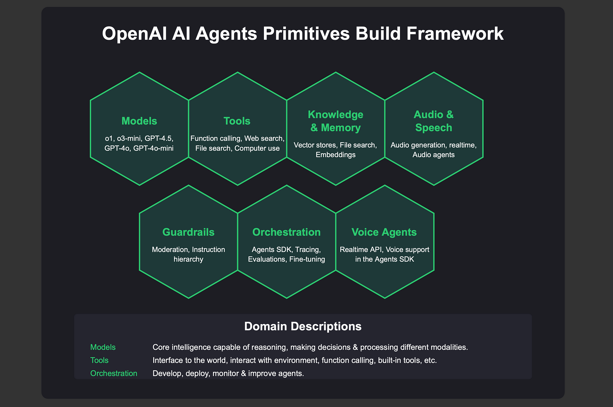

[](https://langfuse.com/docs/integrations/other/openrouter)

To integrate OpenRouter with the OpenAI Agents SDK, you'll leverage OpenRouter's unified API to access a wide range of AI models, while utilizing the OpenAI Agents SDK to build and manage intelligent agents. Here's a step-by-step guide to help you set up this integration:

## 🧩 Prerequisites

* **OpenRouter API Key**: Obtain this from the [OpenRouter Dashboard](https://openrouter.ai/dashboard).

* **OpenAI Agents SDK**: Install the SDK using:

```bash
  pip install openai-agents
```

## 🔧 Integration Steps

### 1. Initialize OpenRouter Client

First, set up the OpenRouter client to interact with the API:

```python
from openai import OpenAI

client = OpenAI(
    base_url="https://openrouter.ai/api/v1",
    api_key="your-openrouter-api-key"
)
```


### 2. Define the Agent

Create an agent using the OpenAI Agents SDK. This agent will utilize the OpenRouter client to make API calls:

```python
from openai_agents import Agent, Runner

def openrouter_agent_function(inputs):
    response = client.chat.completions.create(
        model="openrouter/auto",
        messages=[{"role": "user", "content": inputs['message']}]
    )
    return {"response": response.choices[0].message['content']}

agent = Agent(
    name="OpenRouterAgent",
    tools=[openrouter_agent_function],
    instructions="Use OpenRouter to fetch responses."
)
```


### 3. Run the Agent

Execute the agent to process inputs and generate outputs:

```python
runner = Runner(agent)
result = runner.run_sync({"message": "Hello, OpenRouter!"})
print(result['response'])
```

# OpenRouter with OpenAI Agents SDK Integration

## Overview

This project demonstrates how to integrate OpenRouter with the OpenAI Agents SDK to build intelligent agents that can interact with various AI models through a unified API.

## Setup

1. Install dependencies:

   ```bash
   pip install openai-agents
````

2. Obtain your OpenRouter API key from the [OpenRouter Dashboard](https://openrouter.ai/dashboard).

3. Replace `"your-openrouter-api-key"` in the code with your actual API key.

## Usage

Run the script to see the agent in action:

```bash
python agent_script.py
```
