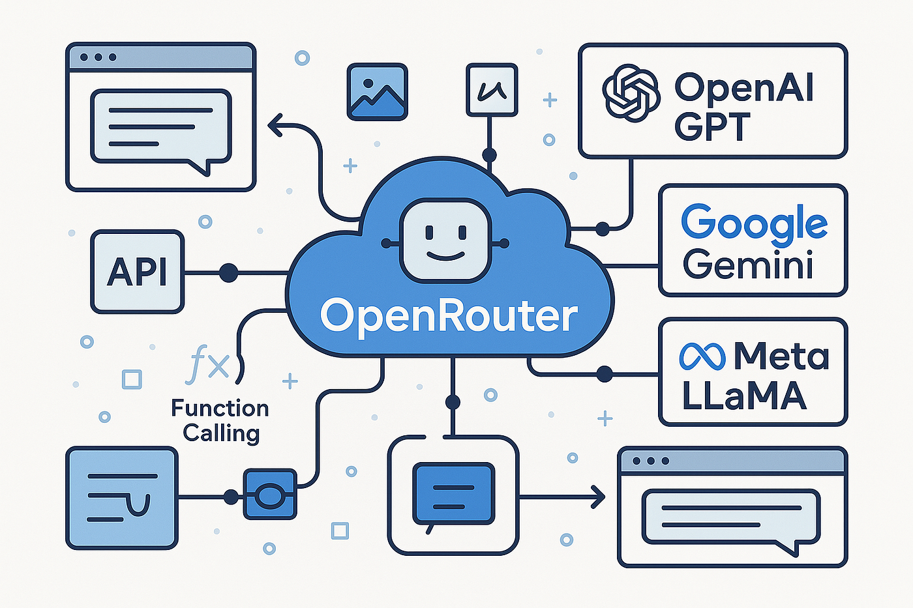

[](https://medium.com/%40mubashirkhi72/openrouter-a-unified-interface-for-50-free-large-language-models-llms-explained-english-9ef0f23371c6)

Certainly! Let's delve into OpenRouter, its functionalities, and how to integrate it into your projects.

## 🧠 What is OpenRouter?

OpenRouter is a unified platform that provides access to over 50 free and paid Large Language Models (LLMs) through a single interface. It simplifies the process of integrating AI models into applications by offering a consistent API, regardless of the underlying model provider. This approach allows developers to focus on building features without worrying about the complexities of individual model APIs.([Medium][1])

## 🔧 Key Features

* **Unified API Access**: Interact with multiple LLMs using a single API endpoint.

* **Automatic Model Selection**: OpenRouter intelligently routes requests to the most suitable model based on the prompt's content.([shloked.com][2])

* **Tool Calling**: LLMs can call external functions or APIs to enhance responses with real-time data.([OpenRouter][3])

* **Streaming Responses**: Receive real-time token delivery for dynamic interactions.([OpenRouter][4])

* **Cost Efficiency**: OpenRouter optimizes for cost by selecting the most affordable model that meets the requirements.([shloked.com][2])


## 🚀 Quickstart Guide

### 1. Obtain an API Key

To get started, you'll need an API key:([OpenRouter][5])

1. Visit the [OpenRouter Dashboard](https://openrouter.ai/dashboard).([OpenRouter][6])

2. Create an account or log in.([Upstash: Serverless Data Platform][7])

3. Navigate to the API section and generate a new API key.

4. Use this key in your requests to authenticate.

### 2. Make a Basic Request

Here's how you can make a simple chat completion request using Python:([OpenRouter][5])

```python
import openai

openai.api_key = 'your-api-key'
openai.api_base = 'https://openrouter.ai/api/v1'

response = openai.ChatCompletion.create(
  model="openrouter/auto",
  messages=[{"role": "user", "content": "Hello, OpenRouter!"}]
)

print(response.choices[0].message['content'])


This code sends a message to the OpenRouter API and prints the AI's response.([OpenRouter][3])

## 🛠️ Advanced Features

### Tool Calling

OpenRouter allows LLMs to call external functions to gather information or perform actions. For example, you can define a function to fetch book titles from Project Gutenberg and let the LLM decide when to use it.([OpenRouter][3])

```python
import requests

def search_gutenberg_books(search_terms):
    search_query = " ".join(search_terms)
    url = "https://gutendex.com/books"
    response = requests.get(url, params={"search": search_query})
    return [{"title": book['title'], "authors": book['authors']} for book in response.json().get("results", [])]
```


Then, integrate this function into your OpenRouter setup to allow the LLM to utilize it when necessary. ([OpenRouter][3])

# OpenRouter Integration

## Overview

This project integrates OpenRouter to provide access to multiple LLMs through a unified API. It demonstrates basic usage and advanced features like tool calling.

## Setup

1. Install dependencies:

   ```bash
   pip install openai requests
````

2. Obtain your API key from the [OpenRouter Dashboard](https://openrouter.ai/dashboard).

3. Replace `'your-api-key'` in the code with your actual API key.

## Usage

### Basic Chat Completion

```python
import openai

openai.api_key = 'your-api-key'
openai.api_base = 'https://openrouter.ai/api/v1'

response = openai.ChatCompletion.create(
  model="openrouter/auto",
  messages=[{"role": "user", "content": "Hello, OpenRouter!"}]
)

print(response.choices[0].message['content'])
```

### Tool Calling Example

```python
import requests

def search_gutenberg_books(search_terms):
    search_query = " ".join(search_terms)
    url = "https://gutendex.com/books"
    response = requests.get(url, params={"search": search_query})
    return [{"title": book['title'], "authors": book['authors']} for book in response.json().get("results", [])]
```

